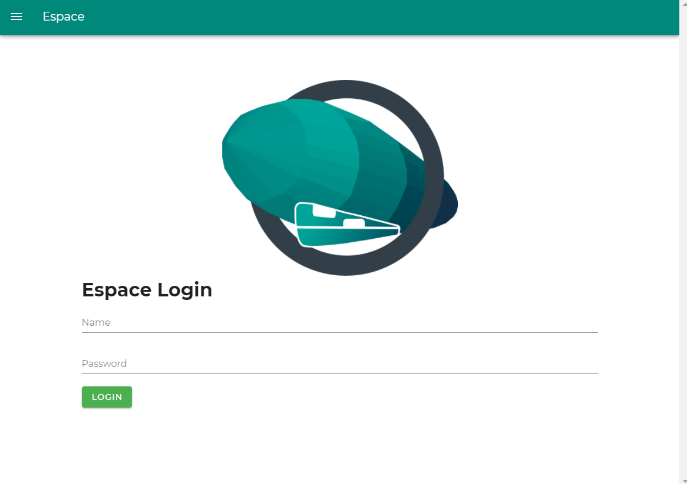

# Espacedition

Espacedition is a clone of the [NUS High School eSpace Website](https://espace.nushigh.edu.sg/Lms/student.aspx). We have based it on an API offered by the NUS High Computer Science Interest Group, [AppVenture](https://nush.app/).

## Login



## Project setup
```
yarn install
```

### Compiles and hot-reloads for development
```
yarn run serve
```

### Compiles and minifies for production
```
yarn run build
```

### Lints and fixes files
```
yarn run lint
```

### Customize configuration
See [Configuration Reference](https://cli.vuejs.org/config/).
